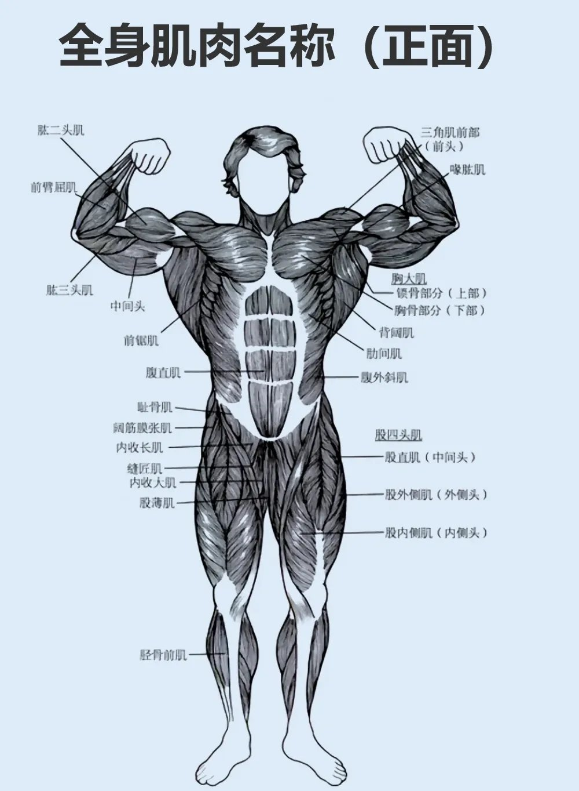
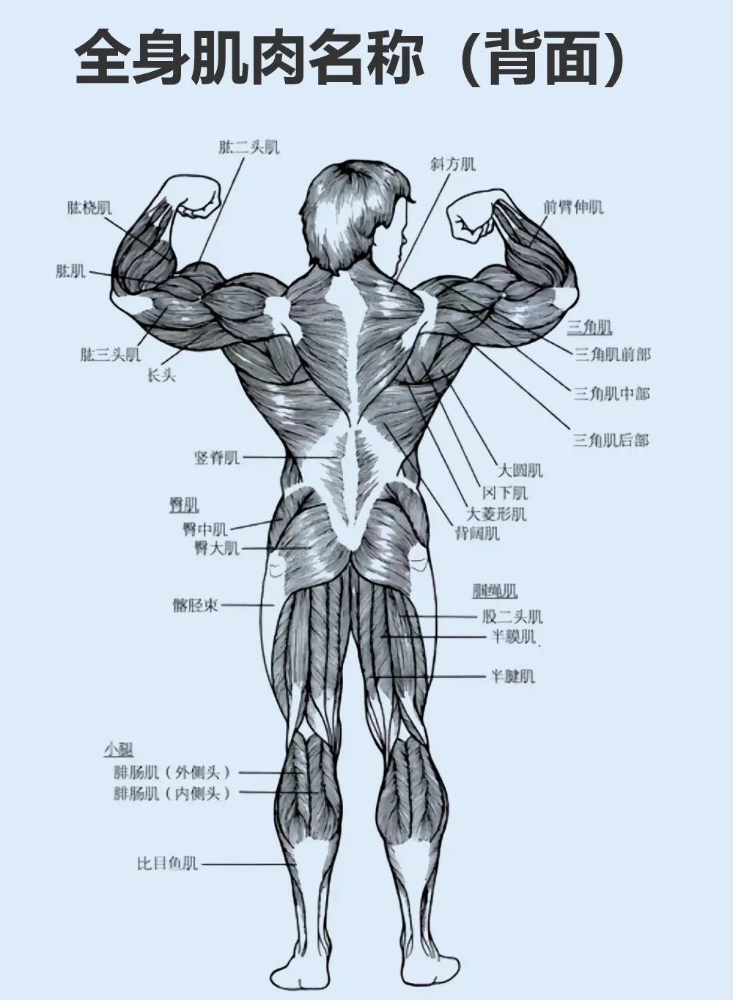

# 参考

| 网站             | URL | 描述 |
|----------------|---|---|
| MuscleWiki（英文） |<https://musclewiki.com/directory>|动作库|

> 背部肌肉：
> **斜方肌**是最外面一整块的“大菱形”。
> **冈下肌**是最外面的、在肩胛骨处的肌肉。
> **大圆肌**、**小圆肌**在冈下肌下一层，更靠近胳肢窝。