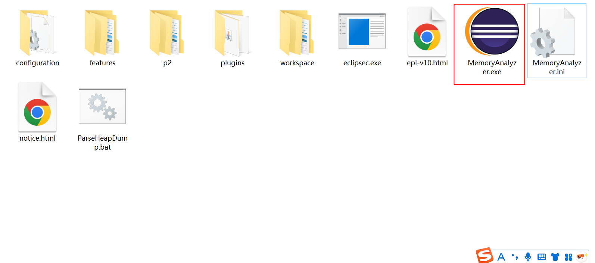
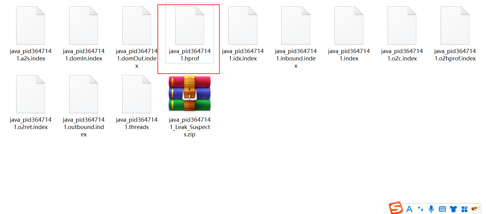
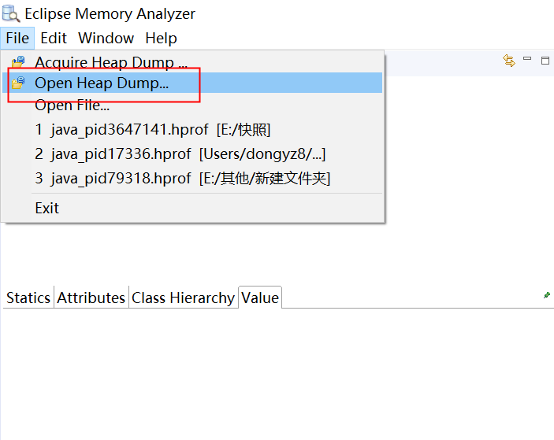
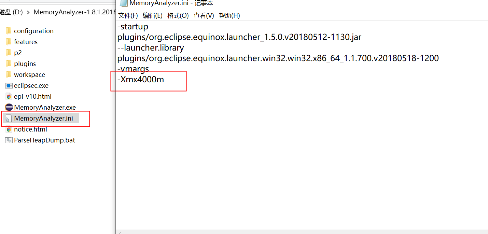
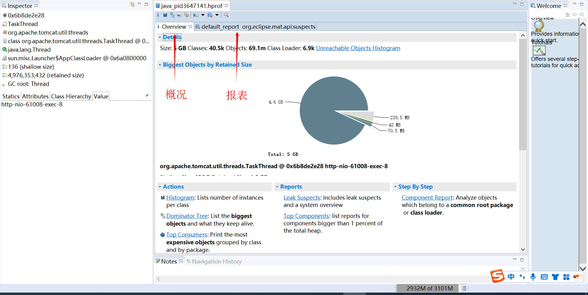
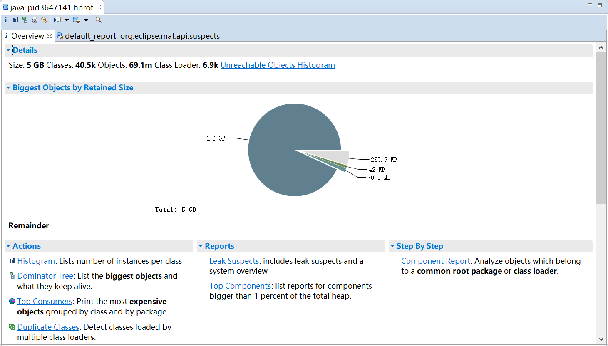
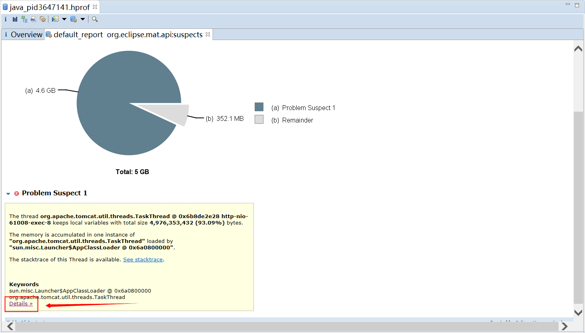
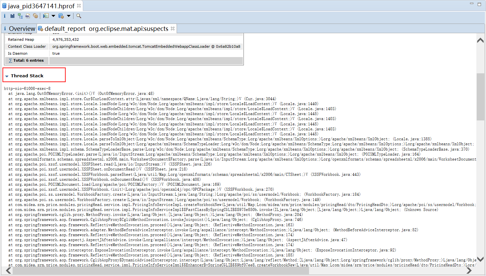

# JVM内存溢出分析实战

分析工具：MemoryAnalyzer.exe（Eclipse）

内存溢出快照（Dump文件）：java_pid*****.hprof

1. 打开分析工具MAT，然后在里面打开Dump文件

2. 打开后便会自动生成一个报表。如果生成过程中内存溢出了，需要在配置文件修改下分析工具的最大内存，然后重启工具

3. 重新生成后，便会生成 **1.概况** 和 **2.报表**。我们可以从这2个地方，寻找内存溢出原因

4. 概况

5. 报表，点击detail查看详情

**Thread Stack**可以查看内存溢出时抛出的异常

